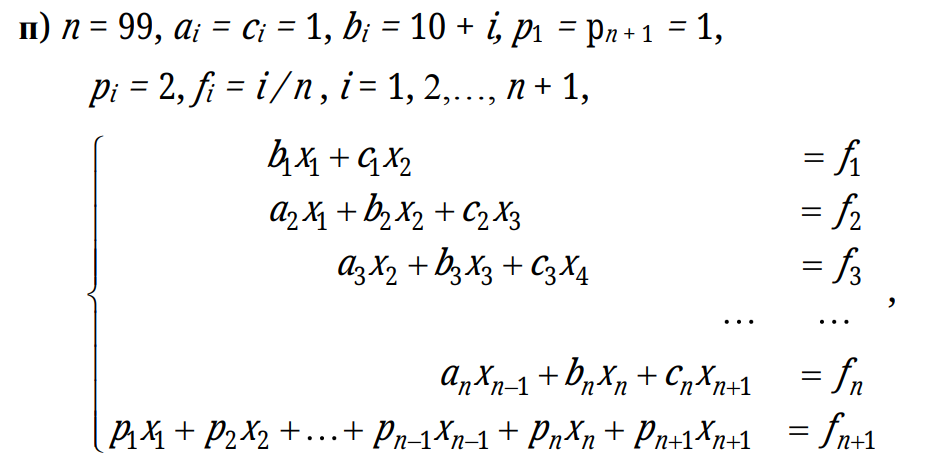

## Лабораторная работа №2. Решение СЛАУ различными способами

Система линейный алгебраических уравнений решается с помощью $LU$ разложения и методом верхних релаксаций.

Исходная матрица выглядит следующим образом:

### Результаты

Результаты нахождения решения СЛАУ различными методами, а также число обусловленности системы, минимальный и максимальное собственные числа матрицы системы и печать невязки итерационного метода верхних релаксаций лежат в файле `report.txt`.
