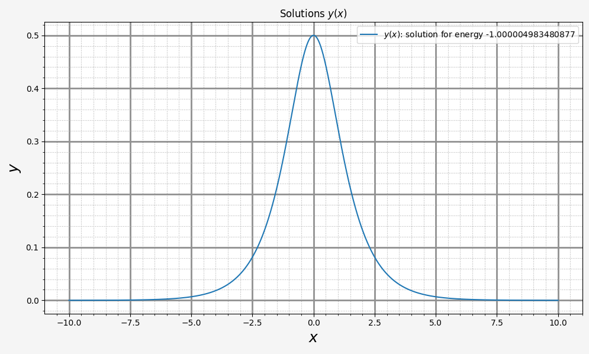

## Лабораторные работы №9 (дополнительная). Решение задачи Штурма-Лиувилля

### 

Решим уравнение Шрёдингера для частицы в некотором потенциальном поле (XI.9.14). Сразу запишем его в приведённых величинах:

$$
\begin{cases}
    y'' + (\lambda - U(x)) y = 0, \; U(x) = -2 \cdot sech^2(x) \\
    y(-\inf) = y(\inf) = 0
\end{cases}
$$

Сразу запишем данное уравнение в нормальной форме Коши:
$$
\begin{cases}
    z' = (U(x) - \lambda ) y, \; U(x) = -2 \cdot sech^2(x) \\
    y' = z \\
    y(-\inf) = y(\inf) = 0
\end{cases}
$$

Задачу будем решать методом стрельбы. Для этого введём сетку: её размер будет ограничен, так как потенциал довольно быстро "затухает", поэтому волновая функция тоже должна быстро затухать. 

Заранее известно, что конечный спектр энергий $`\lambda`$ лежит в пределах от -2 до 0, так как ниже -2 решений не существует, а выше 0 имеем континульный спектр энергий и незатухающие осциллирующие на бесконечности волновые функции.

Потенциал симметричен, а значит коммутирует с гамильтонианом, то есть базис собственной функции является комбинацией чётной и нечётной функций, а значит задачу можно разделить на 2 части: поиск чётной собственной функции и её нормировка, а затем нечётной и последующая нормировка.

В случае чётной собственной функции имеем с точностью до константы $`\frac{\partial y}{\partial x}\big|_{x = 0} = 0, \; y(0) = 1`$, а в случае нечётной фукнции имеем $`\frac{\partial y}{\partial x}\big|_{x = 0} = 1, \; y(0) = 0`$.

Значит, в методе стрельбы остаётся единственным свободным параметром - энергия. Её и будем искать, учитывая известные начальные условия задачи Коши для чётных и нечётных функций.

В конечном результате найдено лишь одно значение энергии $`\lambda = -1`$.

