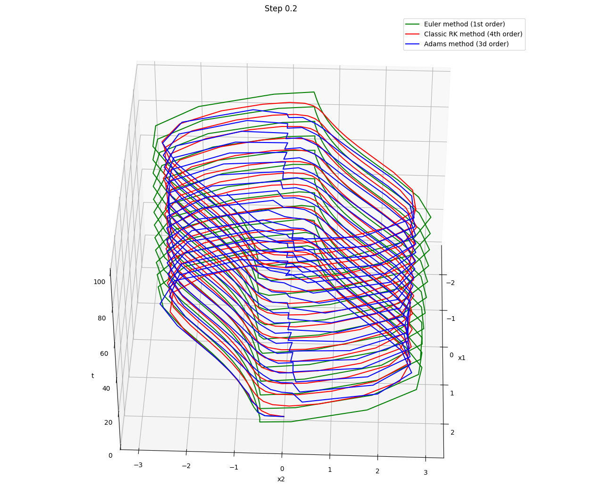
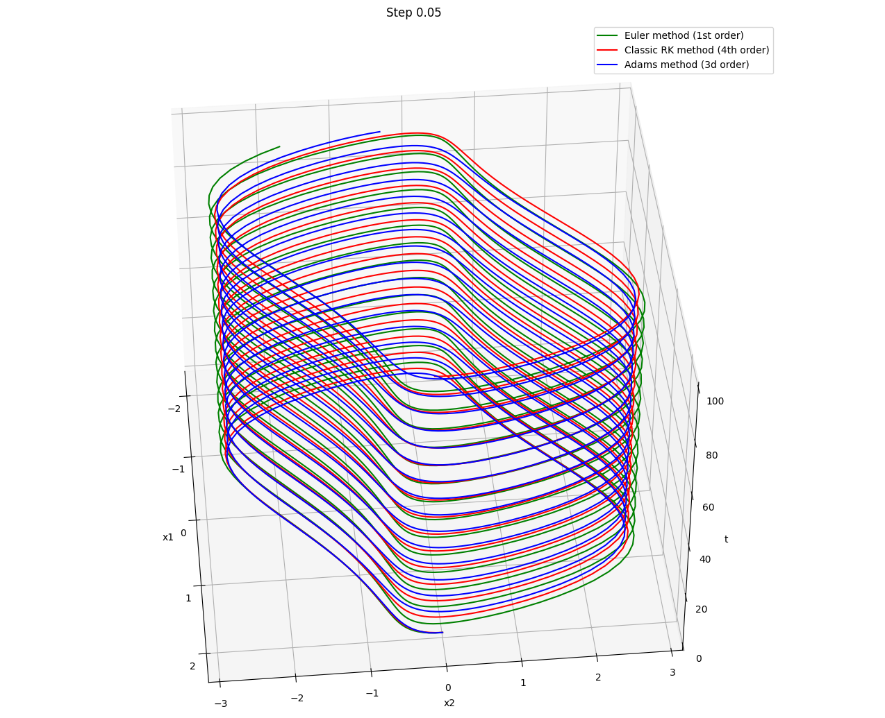
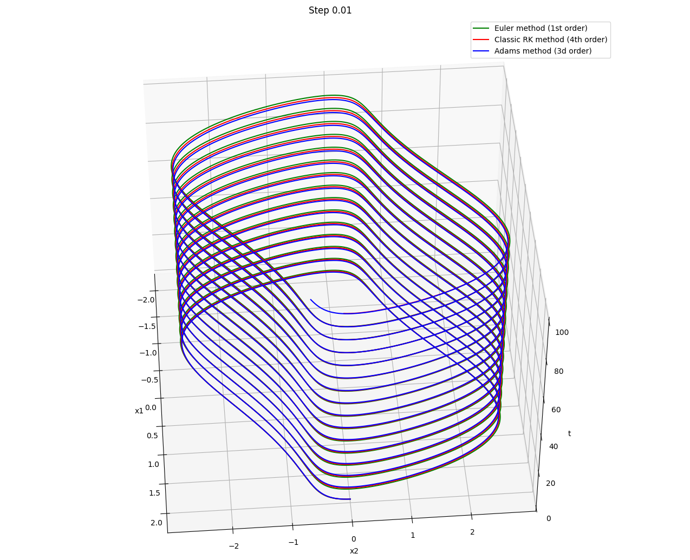
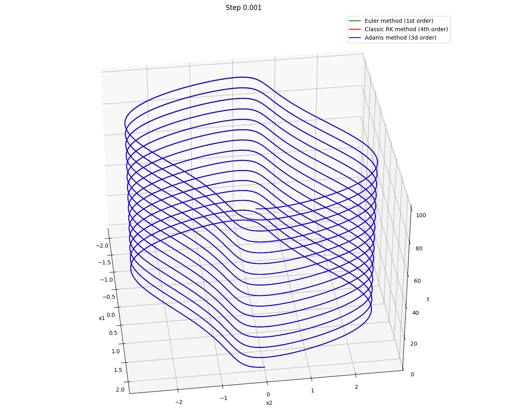
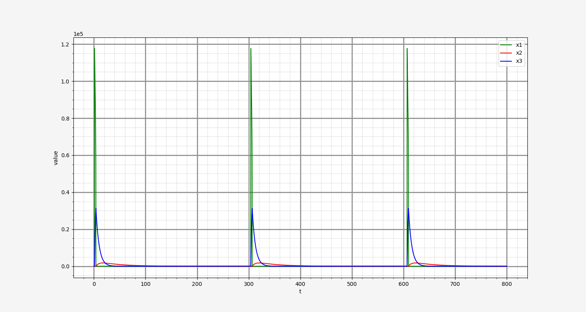

## Лабораторная работа №6. Решение ОДУ (обыкновенных дифференциальных уравнений) явными методами

Рассмотрим дифференциальное уравнения Ван-дер-Поля

$$
y'' + e \cdot (y^2 - 1) y' + y = 0,
$$

или в представлении в виде системы двух ОДУ:

$$
\begin{cases}
    x_1' = x_2 \\
    x_2' = e \cdot (1 - x_1^2) x_2 - x_1, \; e > 0 \\
    x_1(0) = 2, \; x_2(0) = 0.
\end{cases}
$$

Для решения системы воспользуемся явным методом Эйлера 1-ого порядка

$$
\vec{x}_{n + 1} = \vec{x}_{n} + h \cdot \vec{f}(t_{n}, \vec{x}_{n}),
$$

явным методом Адамса 3-его порядка

$$
\vec{x}_{n + 3} = \vec{x}_{n + 2} + h \cdot \left(\frac{23}{12} \vec{f}(t_{n + 2}, \vec{x}_{n + 2}) -
\frac{16}{12} \vec{f}(t_{n + 1}, \vec{x}_{n + 1}) + \frac{5}{12} \vec{f}(t_{n}, \vec{x}_{n}) \right),
$$

и классическим методом Рунге-Кутты 4-ого порядка.

$$
\begin{cases}
    \vec{k_1} = \vec{f}(t_{n}, \vec{x}_{n}) \\
    \vec{k_2} = \vec{f}(t_{n} + \frac{h}{2}, \vec{x}_{n} + \frac{h}{2} \cdot \vec{k_1}) \\
    \vec{k_3} = \vec{f}(t_{n} + \frac{h}{2}, \vec{x}_{n} + \frac{h}{2} \cdot \vec{k_2}) \\
    \vec{k_4} = \vec{f}(t_{n} + h, \vec{x}_{n} + h \cdot \vec{k_3}) \\
    \vec{x}_{n + 1} = \vec{x}_{n} + h \cdot (\frac{1}{6} \vec{k_1} + \frac{2}{6} \vec{k_2} + 
    \frac{2}{6} \vec{k_3} + \frac{1}{6} \vec{k_4}).
\end{cases}
$$

В результате на интервале от `0` до `100` имеем решения для различных шагов:

## Лабораторная работа №7. Решение ОДУ (обыкновенных дифференциальных уравнений) неявными методами

Рассмотрим жёсткую систему дифференциальных уравнений модели Филда-Нойса (орегонатор)

$$
\begin{cases}
    x_1' = 77.27 \cdot (x_2 + x_1 (1 - 8.375 \cdot 10^{-6} x_1 - x_2)) \\
    x_2' = \frac{1}{77.27} \cdot (x_3 - (1 + x_1) x_2) \\
    x_3' = 0.161 \cdot (x_1 - x_3).
\end{cases}
$$

Решим её с помощью неявного метода Гира 3-его порядка, разрешая на каждом шаге нелинейную систему
уравнений методом Ньютона:

$$
\vec{x}_{n + 3} - \frac{18}{11} \vec{x}_{n + 2} + \frac{9}{11} \vec{x}_{n + 1} -
\frac{1}{11} \vec{x}_{n} = \frac{6h}{11} = \vec{f}(t_{n + 3}, \vec{x}_{n + 3}).
$$

В результате получим следующее решение при начальных условиях, близких к нулю:

