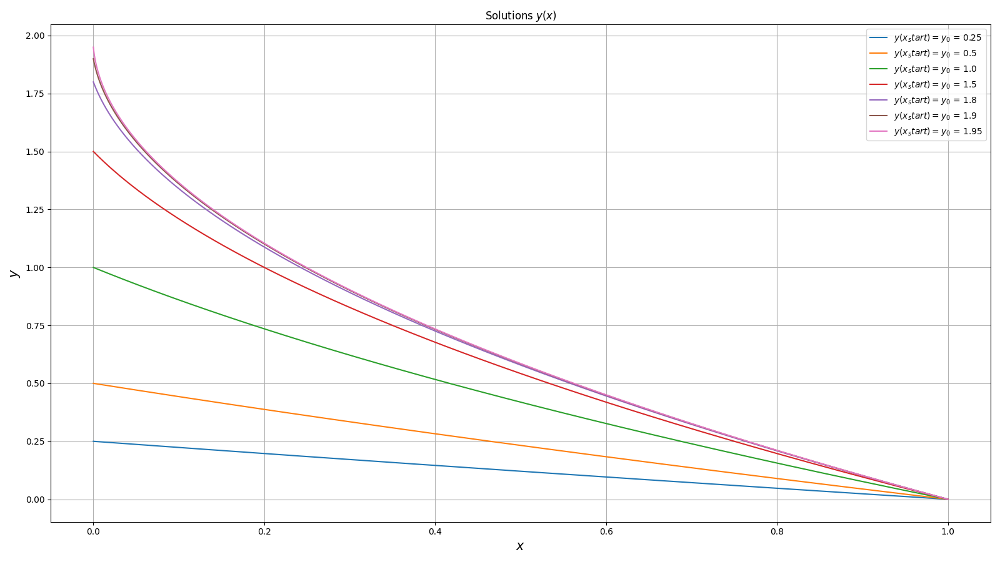
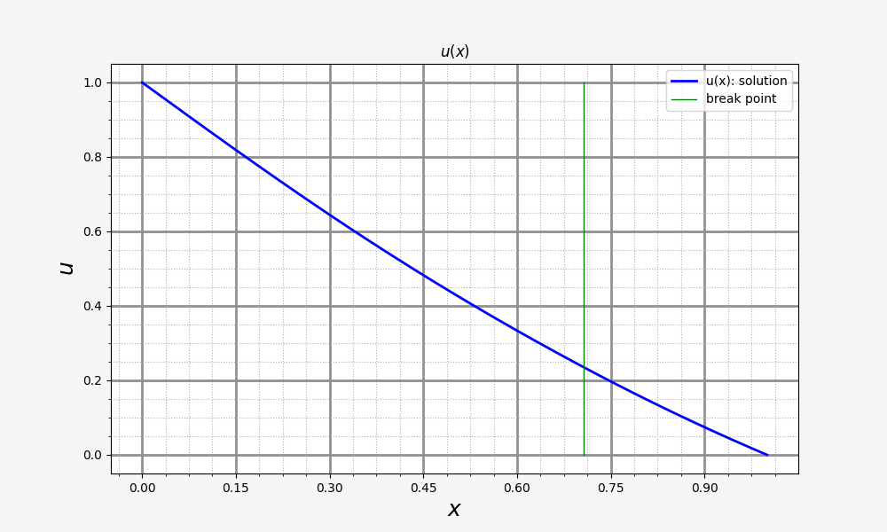

## Лабораторные работы №8-9. Метод стрельбы для нелинейной краевой задачи и метод прогонки для линейно кравевой задачи

### Метод стрельбы

Дана следующая нелинейная краевая задача (XI.9.2, пункт б):

$$
\begin{cases}
    y'' + \frac{0.5}{1 - 0.5y} \cdot (y')^2 = 0, \; 0 \ll x \ll 1 \\
    y(0) = y_0, \; y(1) = 0, \; y_0 = 0.25; 0.5; 1; 1.5; 1.8; 1.9; 1.95;
\end{cases}
$$

Перепишем данное ДУ в нормальном виде:

$$
\begin{cases}
    z' + \frac{0.5}{1 - 0.5 y} \cdot z^2 = 0, \; 0 \ll x \ll 1 \\
    y' = z \\
    y(0) = y_0, \; y(1) = 0, \; y_0 = 0.25; 0.5; 1; 1.5; 1.8; 1.9; 1.95;
\end{cases}
$$

Введём сетку и рассмотрим разностную задачу на сетке.

$$
\begin{cases}
    \frac{z_{n + 1} - z_n}{h} + \frac{0.5}{1 - 0.5 y_n} \cdot z_n^2 = 0, \; 0 \ll x \ll 1 \\
    \frac{y_{n + 1} - y_n}{h} = z_n \\
    y_n|_{n = 0} = y_0, \; y_{N} = 0, \; Nh = 1, \; y_0 = 0.25; 0.5; 1; 1.5; 1.8; 1.9; 1.95;
\end{cases}
$$

Методом стрельбы, меняя начальные условия поставленной задачи Коши для переменной `z`, 
будем получать значения решения на границе, а с помощью метода Ньютона менять начальные условия до
тех пор, пока решение задачи Коши не сойдётся к граничным значениям.

В результате получим графики для различных начальных условий:

### Метод прогонки (линейная краевая задача)

Дано уравнение одномерное станционарное уравнение теплопроводности

$$
\begin{cases}
    \frac{d}{dx}[k(x)\frac{du}{dx}] - q(x)u = -f(x), \\
    u(0) = 1, \\
    u(1) = 0, \\
    u |_{x = x_0 - 0} = u |_{x = x_0 + 0}, \\
    ku_x |_{x = x_0 - 0} = ku_x |_{x = x_0 + 0};
\end{cases}
$$

По условию задачи имеем

$$
\begin{cases}
    k(x) = x^2 + 0.5, \\
    q(x) = 1, \; f(x) = 1, \; x < x_0, \\
    q(x) = \exp(-x^2), \; f(x) = \cos(x), \; x > x_0, \\
    x_0 = \frac{1}{\sqrt(2)}
\end{cases}
$$

Введём сетку  $x_n = nh$, $n = \overline{0, N}$, $Nh = 1$. Точка разрыва $`x_0`$ расположена между узлами $`n_l`$ и $`n_r`$.
Разностная задача запишется следующим образом:

$$
\displaystyle\frac{k_{n + 1/2}(u_{n + 1} - u_n) - k_{n - 1/2}(u_{n} - u_{n - 1})}
{h^2} - q_n u_n = -f_n, \; n = \overline{1, n_l - 1}, \; n = \overline{n_r + 1, N - 1}\\
$$

Недостающие уравнения из системы (4 уравнения) находятся из граничных условий задачи в точках $`x = 0`$, $`x = 1`$ и $`x = x_0`$.

Данную разностную задачу можно решить встречным методом трёхдиагональной прогонки: обычный метод прогонки слева направо до точки разрыва и справа налево до точки разрыва, после чего недостающие переменные находятся из граничных условий и совершается обратная прогонка в обе стороны.

Имеем для данной задачи следующее решение:

